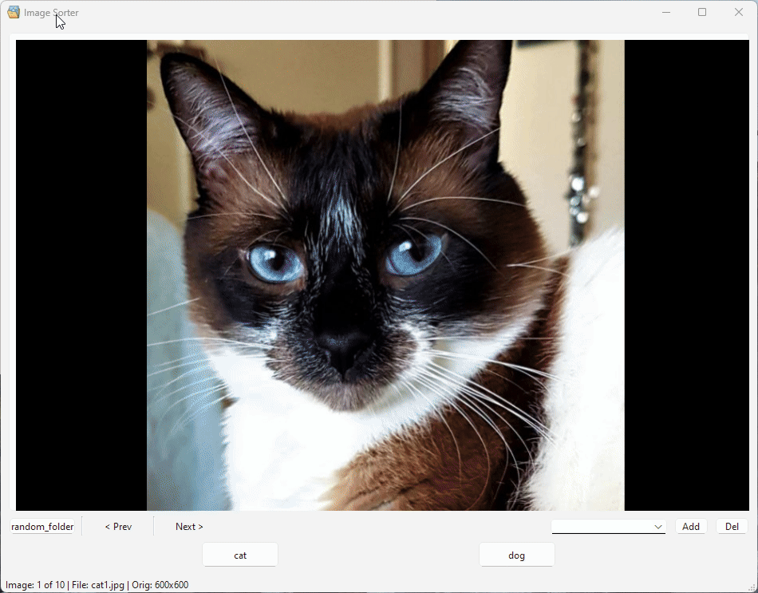

# Simple Python Image sorting tool

This is a simple Python app that allows you to sort images by categories and move them to corresponding folders. The app uses the `PyQt6` module for its GUI and python 3.10.0 or higher.

## Features
* Dynamic image sizing to fit the size of the window. Images are scaled either vertically or horizontally.
* Next and Previous buttons to allow you to skip images and return to previous images.
* Moved image information to the status bar instead of having that in the application directly.

## Improvements
* Added some exception handling to account for corner cases that the original application didn't handle properly.
* Hide certain buttons that would crash the application if they were clicked prior to selecting a folder.
* Allowed better handling of switching between image folders more gracefully.
* Fixed an "off by one" error in the image counts.
* Removed click on image name opening default image viewer. The application is already an image viewer this function was redundant.

### How to install
- Clone this repository 
- Install dependencies by running `pip install -r requirements.txt`
- Run the main file by running `python main.py`

### Dynamic Image Resizing Demo

### Next and Previous Buttons Demo

### How to use
- Press "Select Folder" button and select the folder that contains the images you want to sort
- Type in the new category name if needed in the droplist and press "Add" button. You can add as many categories as you like.
- To delete a category, select it from the droplist and press "Del" button. Keep in mind that all the images from that category will be moved to main folder
- To move the image to the desired category, press button with the name of the category.

### Improvements
- Would like to create a build process to build different versions of the app for different platforms (Win, Mac, Linux)
- Allow ability to create folders in other locations, or use existing folders in other locations and saving that information across application restarts.

### Minor Bugs
- There is a small border around the image on the top and left. I would like to remove this, but can't figure out exactly how yet.

### Original Source
Original code taken from: [https://github.com/aspicho/image-sorter.git](https://github.com/aspicho/image-sorter.git)